# Documentación práctica Tomcat y Maven

Este documento está dirigido a aquellos que son nuevos desplegando aplicaciones web Java y quieren aprender cómo hacerlo usando Apache Tomcat.

No es necesario conocimiento previo de programación en Java, aunque alguna experiencia con algún lenguaje de programación será útil. Será necesario utilizar la línea de comandos y conocer las operaciones básicas. También necesitaremos utilizar un editor de texto o entorno de programación.

## Instalación de Tomcat

Esta práctica es muy sencilla y va a consistir en realizar la instalación del servidor de aplicaciones Tomcat 9, en una máquina virtual corriendo Debian 11 Bullseye.

Para ello realizaremos:

- Instalación de OpenJDK.

- Instalación de Tomcat 9

## OpenJDK

Instalaremos el kit de desarrollo de java:

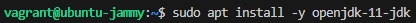

## Tomcat

Instalaremos el servidor de aplicaciones Tomcat y realizaremos las siguientes tareas:

- Creación de un grupo de usuarios específico para Tomcat.

- Creación de un usuario dedicado para el servicio.

- Comprobación del estado del servicio para verificar que está activo.

### Instalación del paquete

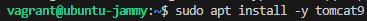

### Creación del grupo y usuario

Crearemos un grupo de usuarios para tomcat9 y un usuario.

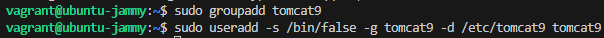

Esta orden crea un nuevo usuario llamado tomcat9 con características específicas para su uso como cuenta de servicio en el sistema. Aquí se desglosa lo que hace cada opción:

- -s /bin/false: Establece el intérprete de comandos (shell) como /bin/false, lo que impide que este usuario inicie sesión en el sistema. Esto se hace por seguridad, ya que el usuario solo será utilizado para gestionar el servicio Tomcat y no necesita acceso interactivo.

- -g tomcat9: Especifica que el grupo principal del usuario será tomcat9. Este grupo debe haberse creado previamente con el comando groupadd tomcat9.

- -d /etc/tomcat9: Define el directorio de inicio del usuario como /etc/tomcat9. Aunque este usuario no tendrá un entorno de inicio interactivo, esta carpeta puede utilizarse para almacenar configuraciones específicas relacionadas con Tomcat.

- tomcat9: Es el nombre del usuario que se crea.

### Arranque y comprobación del servicio

Arrancaremos el servicio tomcat9 y comprobamos que el servicio funciona correctamente.

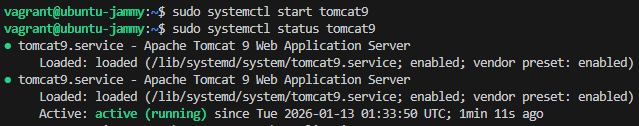

Accederemos al servicio en http://localhost:8080/

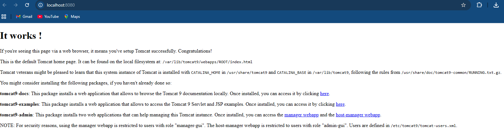

### Acceso remoto

Tomcat no permite por defecto que se acceda a algunos paneles de control desde un ordenador distinto al localhost. Para solucionarlo sustituiremos el fichero context.xml del directorio /usr/share/tomcat9-admin/host-manager/META-INF/ por el siguiente:

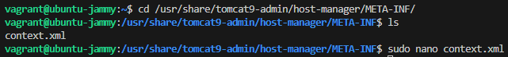

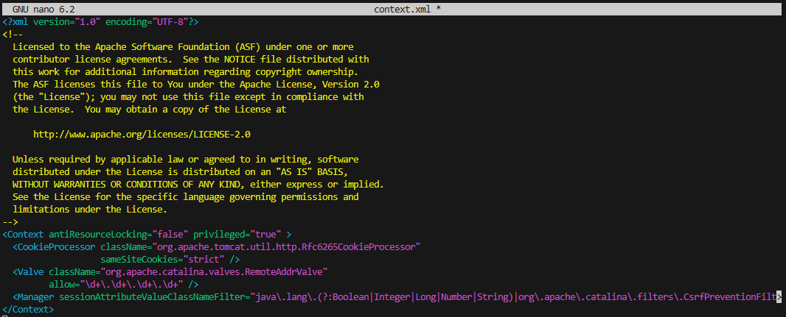

La línea <Valve className="org.apache.catalina.valves.RemoteAddrValve" allow="\d+\.\d+\.\d+\.\d+" /> dentro del código XML tiene el propósito de restringir el acceso a una aplicación o recurso de Tomcat basado en la dirección IP del cliente. En este caso, permite el acceso desde todas las direcciones IP, ya que no hay restricciones específicas configuradas.

Recargaremos el servidor:

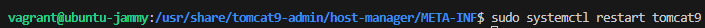

## Configuración de la administración

### Usuarios y permisos

Ahora es el momento de definir el usuario con acceso a Tomcat. Para ello, es necesario editar el archivo de configuración /etc/tomcat9/tomcat-users.xml.

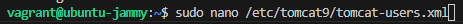

Este archivo configura un usuario llamado alumno con acceso completo a las funcionalidades administrativas y de gestión del servidor Tomcat, tanto en la interfaz gráfica como en las operaciones relacionadas con aplicaciones. Es una configuración típica para entornos de prueba o desarrollo.

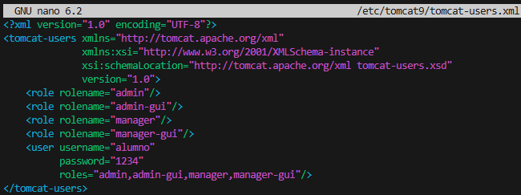

Los elementos principales de la configuración son:

1. Roles:

Se definen roles específicos con el elemento <role> y su atributo rolename.

Roles creados:

- admin: Permite realizar tareas administrativas.

- admin-gui: Habilita el acceso a la interfaz gráfica de administración.

- manager: Da permisos para gestionar aplicaciones.

- manager-gui: Permite utilizar la interfaz gráfica de gestión de aplicaciones.

2. Usuarios:

El elemento <user> define un usuario con los siguientes atributos:

roles="admin,admin-gui,manager,manager-gui": Asigna los roles
definidos anteriormente al usuario.

### Instalación del administrador web

Ahora, instalemos el administrador web y el administrador de host de Tomcat ejecutando el siguiente comando.

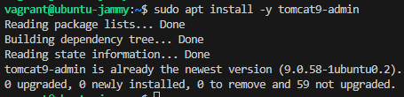

El paquete tomcat9-admin proporciona herramientas adicionales para la administración del servidor Tomcat 9, específicamente las aplicaciones de gestión basadas en web. Estas herramientas incluyen las interfaces de administración y gestión que permiten realizar tareas administrativas de forma más visual e interactiva.

### Funciones del paquete tomcat9-admin

Aplicación de Administración (Admin GUI)
    Permite gestionar configuraciones del servidor, como recursos, conexiones, y otros parámetros avanzados. Es útil para administradores que necesitan realizar cambios en la configuración de Tomcat sin editar directamente los archivos XML.

Aplicación de Gestión (Manager GUI)
    Permite realizar tareas relacionadas con las aplicaciones web desplegadas en Tomcat, como: Desplegar nuevas aplicaciones. Detener o reiniciar aplicaciones existentes. Consultar información sobre el estado de las aplicaciones (carga de memoria, uso de hilos, etc.).

    Proporciona una interfaz gráfica para operaciones que podrían realizarse mediante scripts o herramientas CLI.

### Acceso a los paneles de administración

Accede a http://localhost:8080/manager/html e introduce el nombre de usuario y la contraseña que escribió al editar el archivo /etc/tomcat9/tomcat-users.xml.

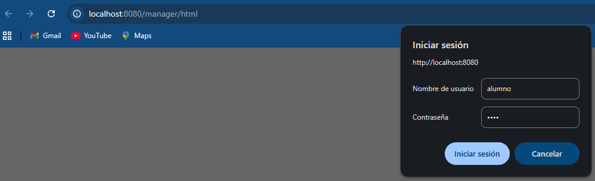

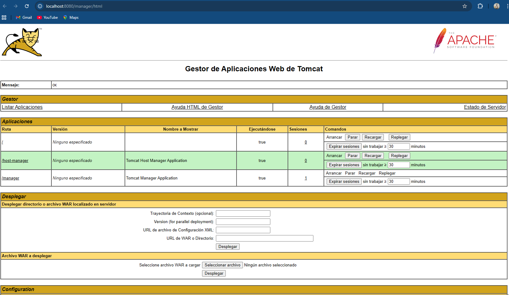

Ahora accedamos a http://localhost:8080/host-manager/html para verificar el Administrador de host virtual Tomcat; escribe el nombre de usuario y la contraseña cuando te lo soliciten.

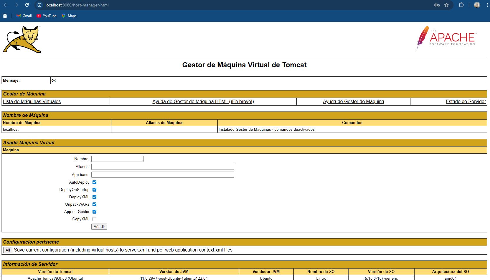

## Despliegue manual mediante GUI

Realizaremos el despliegue manual de una aplicación ya previamente empaquetada en formato WAR.

Para ello:

1. Nos logueamos con el usuario previamente creado.

2. Descargamos el archivo tomcat1.war que acompaña a las prácticas.

3. Buscamos la sección que nos permite desplegar un WAR manualmente.

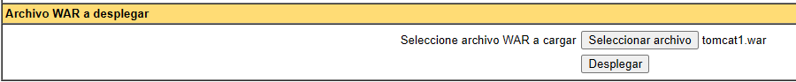

4. Pulsamos en Examinar/Browse, y buscamos el fichero tomcat1.war.

5. Pulsamos Desplegar/Deploy. Se nos listará la aplicación ya desplegada /tomcat1 como un directorio más y podremos acceder a ella.

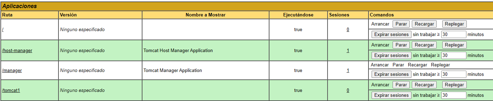

## Despliegue con Maven

### Instalación de Maven

Para instalar Maven en nuestro Debian usaremos:

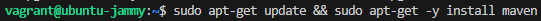

Para comprobar que todo ha ido correctamente, podemos ver la versión instalada de Maven:

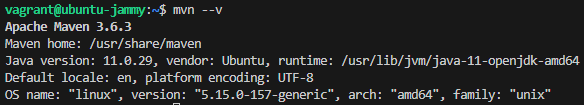

### Configuración de Maven

Para poder realizar despliegues en nuestro Tomcat previamente instalado, necesitamos realizar la configuración adecuada para Maven.

### Roles

En primer lugar necesitamos asegurarnos de que en el apartado anterior de la práctica hemos añadido todos los usuarios necesarios, así como sus respectivos roles.

Debemos añadir el rol de manager-script para permitir que Maven se autentique contra Tomcat y pueda realizar el despliegue. Los roles utilizados por Tomcat vienen detallados en su documentación, que merece ser consultada.

Puedes encontrar los nombres de los roles en el archivo web.xml de la aplicación web del Administrador. Los roles disponibles son:

manager-gui
    Acceso a la interfaz HTML.

manager-status
    Acceso solo a la página de «Estado del Servidor».

manager-script
    Acceso a la interfaz de texto plano amigable para herramientas que se describe en este documento, y a la página de «Estado del Servidor». manager-jmx

Acceso a la interfaz proxy JMX y a la página de «Estado del Servidor» En dicha documentación se nos indica que, por temas de seguridad, es recomendable no otorgar los roles de manager-script o manager-jmx al mismo usuario que tenga el rol de manager-gui.

Así las cosas, modificamos el archivo /etc/tomcat9/tomcat-users.xml acorde a nuestras necesidades (los nombres de usuario y contraseña deberán ser los que elijáis para vosotros):

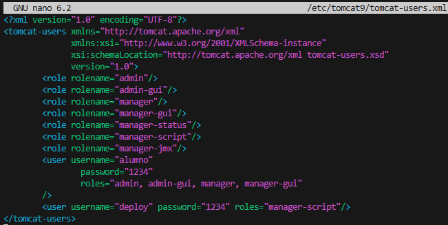

### settings.xml

Edita el archivo /etc/maven/settings.xml para indicarle a Maven, un identificador para el servidor sobre el que vamos a desplegar (no es más que un nombre, ponedle el nombre que consideréis), así como las credenciales. Todo esto se hará dentro del bloque <servers> del XML:

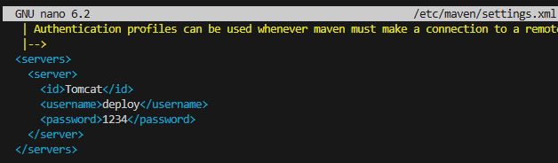

### Generar una aplicación

Generaremos una aplicación de ejemplo en nuestro directorio personal:

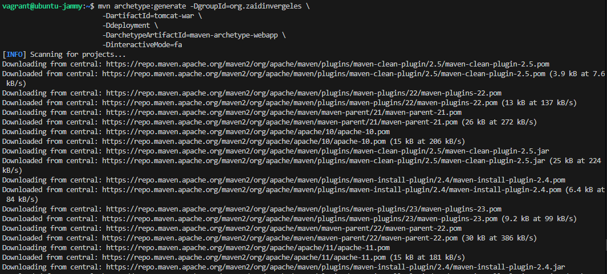

Tras muchas líneas veremos:

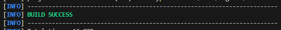

Se habrá creado un directorio llamado tomcat-war. Entraremos en él:

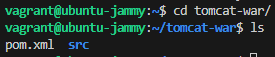

### POM

Ahora debemos modificar el POM del proyecto para que haga referencia a que el despliegue se realice con el plugin de Maven para Tomcat. Fichero pom.xml donde modificaremos la parte enfatizada.

Añadimos el bloque build:

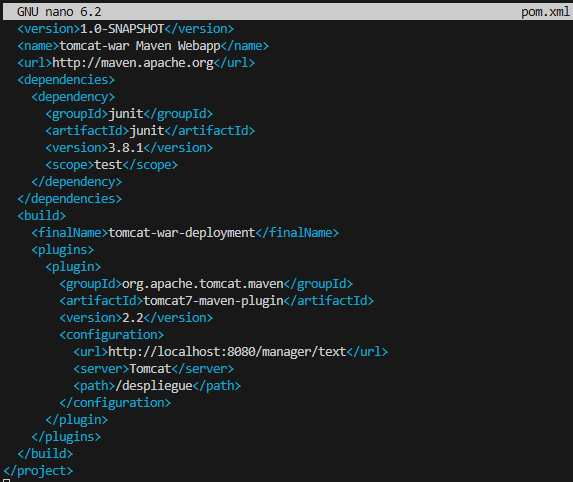

Línea 2
    pondremos el nombre final del ejecutable .jar que se va a generar.

Línea 9
    URL del servidor Tomcat donde se hará el despliegue. Como en nuestro caso Maven y Tomcat están en el mismo servidor, la URL corresponde a localhost. Esta URL debe ir seguida por /manager/text, tal y como leemos en la documentación del plugin

Línea 10
    Nombre del servidor donde se va a desplegar la aplicación. El nombre debe ser consistente con lo que hayamos puesto en el settings.xml del paso anterior.

Línea 11
    Nombre que la aplicación utilizará en el path de la URL.

### Despliegue

Tras generar esta aplicación, los comandos finales que se utilizan en Maven para desplegar son:

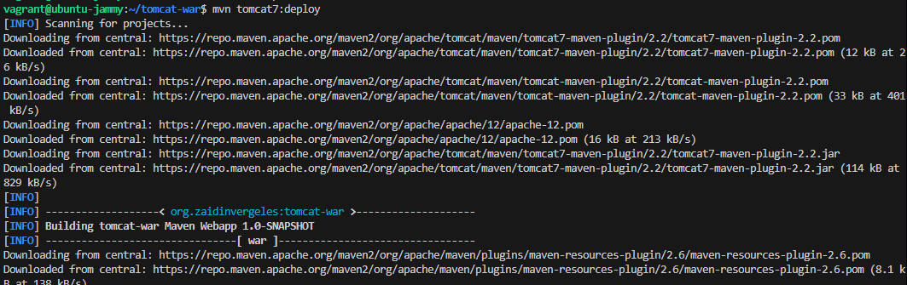

Volver a desplegar una aplicación

**mvn tomcat7:redeploy**

Retirar una aplicación desplegada

**mvn tomcat7:undeploy**

Así pues, tras el despliegue con Maven nos indicará que todo ha ido correctamente con un mensaje de BUILD SUCCESS, tal que así:

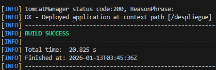

Y, accediendo a través de la GUI, debemos ver que la aplicación está desplegado y que podemos acceder a ella perfectamente: http://servidor:8080/despliegue

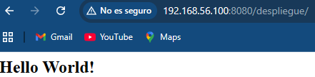

## Tarea

Realizar el despliegue con la aplicación de prueba.

Repetir el despliegue pero esta vez con otra aplicación que no es la de prueba. Usaremos los comandos que veremos a continuación.

Clonamos el repositorio y nos colocamos dentro de él, y una vez estamos detro cambiamos de rama.

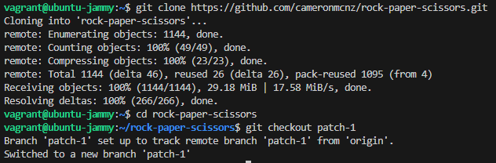

Tras esto debemos proceder exactamente igual que en el caso anterior, con la ventaja de que ya tenemos configurados los usuarios de Tomcat y los parámetros de Maven.

Así pues, sólo habría que añadir el bloque <plugin>…</plugin> adecuado para poder hacer nuestro despliegue.

Documenta, incluyendo capturas de pantallas, el proceso que has seguido para realizar el despliegue de esta nueva aplicación, así como el resultado final.

Para seguir con la tarea, cambiamos el contenido del pom.xml, cambiando el bloque plugin de la siguiente manera:

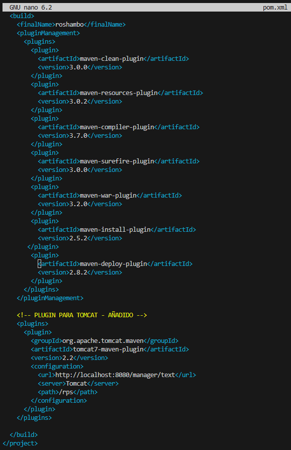

Ahora accedemos a la app y comprobamos que funciona:

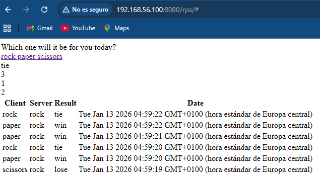